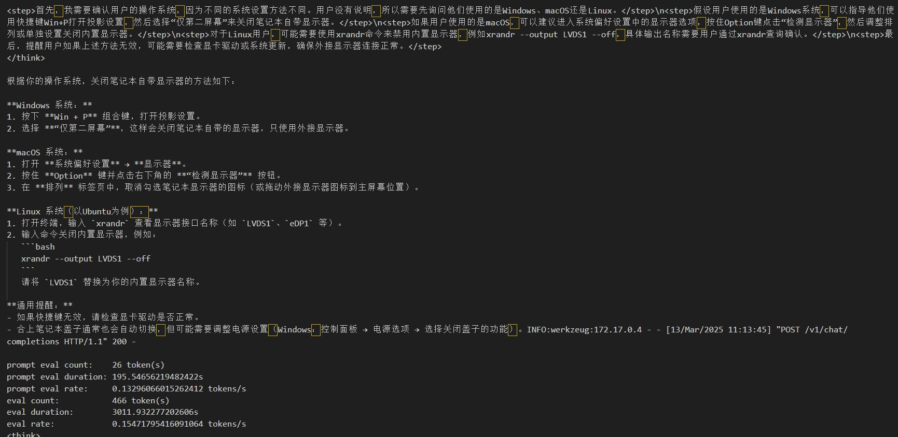

# Deployment of ktransformers Deepseek-r1 Full Version Integrated with AnythingLLM Tool, Supporting Knowledge Base Invocation

## Source Code Located in Master Branch

### Ktransformers based on official version v0.2.1, supports streaming return, compatible with OpenAI API format

- Modified `./ktransformers/util/utils.py` file, added variables to the generation method for optional streaming returns.
- Based on the official local_chat.py, integrated with Flask framework to implement OpenAI-compatible streaming APIs located in `./ktransformers/chat_openai.py`.
- Note that you need to separate configuration and model weight files for chat_openai.py (regarding configuration files and weight files, sources like HuggingFace, Mota Community, etc., are available; I used a GGUF format model weight).

### Deployment Requirements

- The version I deployed is Deepseek-R1-671b-Q8, which has minimal performance loss compared to the full version of Deepseek. The performance loss of the 8-bit precision version is negligible (proven by Meituan).
- Requires around 713G of memory (my system memory was insufficient, so I used virtual memory, which significantly slowed down the process due to frequent data swapping).
- 
- Only 14G of VRAM is required, without high demands on the GPU.
- 
- Here, I tested my locally deployed Deepseek, as shown in the figure, this configuration is still suitable for the Q4 version.
- 

### Pain Points

- Installed Ktransformers according to the official tutorial and deployed Deepseek on top of it. Successfully built the large model foundation using the official demo.
- However, for practical applications, just the base model isn't enough; upper-layer services providing functionalities such as file reading and knowledge base integration are needed. There are already several mature tools available for these purposes.
- For example: Anythingllm, dify.
- I used a localized deployment of Anythingllm, which seamlessly connects with locally deployed large models via Ollama, but cannot directly utilize models deployed through Ktransformers.
- As of now, there hasn't been any support from Ktransformers for streaming response generation; local_chat.py can only stream print to the console and cannot return responses via an API.

### Solutions

- Since the Anythingllm tool supports all interfaces compliant with the OpenAI API specification, we need to encapsulate the deepseek deployed based on Ktransformers into an OpenAI-compatible interface.
- Here, I adopted the official interface of Deepseek, invoked the official interface to obtain streaming response results, and encapsulated the interface based on those results.
- Finally, the issue to be addressed is that the generation method in Ktransformers waits until all tokens are generated before returning, which is incompatible with the streaming approach. Therefore, modifications were made to the `./ktransformers/util/utils.py` prefill_and_generate method.
- The prefill_and_generate method was modified to return content once a token is generated, achieving a streaming return.

### Anythingllm Invocation Result Display

- 
